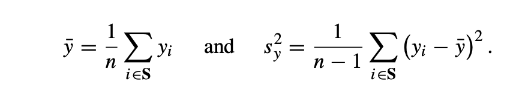
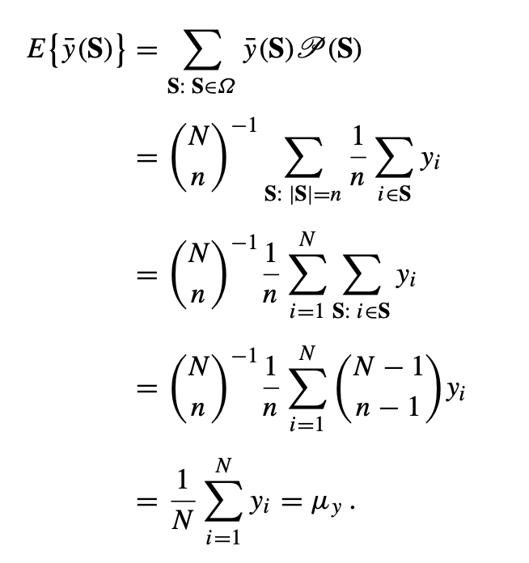
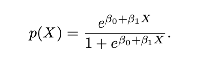

```{r setup, include=FALSE}
knitr::opts_chunk$set(echo = TRUE)
```

```{r include=FALSE}
## Install packages and read libraries

# install.packages("kableExtra")
# install.packages("RColorBrewer")
# install.packages("gridExtra")

library(tidyverse)
library(RColorBrewer)
library(broom)
library(gridExtra)
library(grid)
```

# Introduction 

In this paper, we will use a Randomized Controlled Trial (RCT) to analyze the relationship between opening some Ontario restaurants for indoor dining (treatment group) and the remaining restaurants will remain shuttered to indoor dining. The Centre for Disease Control (CDC) defines indoor dining 
The code and data supporting this analysis is available on our [GitHub repository](https://github.com/lauracline/Opening-Ontario-Restaurants-for-Indoor-Dining-and-Contact-Traced-COVID-19-Cases) for this project: <https://github.com/lauracline/Opening-Ontario-Restaurants-for-Indoor-Dining-and-Contact-Traced-COVID-19-Cases>. 

The remainder of this paper is structured as follows: Section 2 discusses the data, intervention, data gathering methodology, data ethics, descriptive data analysis, and determines if the treatment and control groups are representative samples. Section 3 performs linear regression and logistic regression to test our hypothesis. Finally, Section 4 discusses the study's findings and some weaknesses. 

# Data Description 

## The "Name of Our Survey" Dataset 
Include the link to the survey. 

## Intervention 

## Population, Frame, and Sample

The population in question for this survey is all restaurants in Ontario, and our sampling frame are Ontario restaurants registered under the Canadian Business Registries. From this, our final survey sample will be Ontario restaurant owners who respond to an electronic questionnaire sent via. email. As an incentive, we will inform survey candidates that their responses will help shape policies being put in place by the Ontario Provincial government geared towards relieving the economic impact restaurants face during the COVID-19 pandemic.

## Sampling Strategy 

As a means of mitigating bias in our survey, our sampling methodology is somewhat twofold, with the first sample attempting to mitigate the biases introduced in the 'second.' Furthermore, we cannot use cluster or stratified sampling because we are unable to determine whether a restaurant belongs to a particular strata or cluster because this data is not available in Canada's Business Registries. Instead, we are using a *simple random sample without replacement* (SRSWOR) whereby the sample is randomly selected from a subset of the population. Practically, this means each sample observation is individually selected with an equal probability of being drawn. The practical sampling procedure utilized to draw a sample from our population comes from the tidyverse package in the R statistical programming language. 

In this sampling method, each member of the population has an exactly equal chance of being selected for the survey. This is the optimal sampling method for this survey because it involves a single random selection and requires little knowledge in advance about the demographics of the population. This method also has high internal validity because it reduces the impact of potential confounding variables. With a large enough sample size, a simple random sample also has high external validity because it will represent all the characteristics of the larger population. The sampling design we utilized comes from Wu and Thompson [@citeWu] and will assume population values are fixed, which they will be at the time the sample is drawn from the Canadian Business Registries. It is also assumed that our SRSWOR satisfies the following probability measure:


As previously noted, given a large enough sample size, estimators such as the sample mean (average) and sample variance ('spread-outedness' of the data) can aid us in making inferences about our population as a whole, the sample mean and sample variance can be written as:



Given the above statistical expressions that define the sample mean and probability measure, estimating our population mean through SRSWOR can be achieved as follows when yhat(**S**) and P(**S**) are expanded into their whole expressions and subsequently manipulated in the following proof from Wu and Thompson:



For our purposes, this proof gives us sufficient reason to believe the simple random sampling method we want to use is in fact random and will tell us information that is relevant to the population itself. 

While not necessarily a second stage, since we are relying on data gathering techniques that require voluntary response to survey sent via. email, it is still important to note the biases such a selection process can bring with it. In a word, while a simple random sample was introduced to reduce bias, self reporting may reintroduce it to a lesser degree. This could be potentially compounded by the offered incentive, which may provide a larger pool of businesses that have been adversely impacted by the COVID-19 pandemic than those who have not. While this is a minor consideration given the emphasis placed on conducting a SRSWOR is a sufficient size in our initial sampling phase, it is still worth noting as a possible bias in the data.

## Data Ethics 

## Descriptive Data Analysis

```{r include=FALSE}
## BUILD SURVEY ##

## Set Seed 
set.seed(888)

## Survey Questions 
# Q1: In what year was your business first established?
# Q2: Over the past year (March 2020 to present), how has each of the following changed for this business? (Sales)
# Q3: Over the past year (March 2020 to present), how has each of the following changed for this business? (Number of Employees)
# Q4: Over the past year (March 2020 to present), how has each of the following changed for this business? (Gross Revenue)
# Q5: Over the past year (March 2020 to present), how has each of the following changed for this business? (Gross Expenses)
# Q6: Over the past year (March 2020 to present), how has each of the following changed for this business? (Net Revenue)
# Q7: Which of the following have been obstacles to your business? 
# Q8: Due to COVID-19, was funding or credit for this business approved or received through any of the following sources? Pick the option where the majority of the business's funding is coming from. 
# Q9: If you answered “None of the Above” for the question above, for which of the following reasons has the business not accessed any funding or credit due to COVID-19? 
# Q10: Does the business have the ability to take on more debt?
# Q11: How long can this business continue to operate at its current level of revenue and expenditure before having to consider permanent closure or bankruptcy?
# Q12: Is 50% or more of our business owned by a by a BIPOC visible minority (BIPOC visible minority is Canada is defined as someone who is non-white in colour or race, regardless of place of birth)? 
# Q13: If >= 50% of this business’s owners are BIPOC visible minorities, please select the categories that describe the owner or owners?
# Q14: Is 50% or more of our business owned by a by immigrants to Canada? 
# Q15: Does your business have access to platforms like UberEats, Doordash, or SkipTheDishes to complete delivery and takeout orders?
# Q16: If you selected option a above, does your business use platforms like UberEats, Doordash, or SkipTheDishes to complete delivery and takeout orders?
# Q17: If you selected option d above, why did you stop using these platforms?

## Create a tibble and put in each survey question 

sampling_frame_restaurant_population <- 
  tibble(person = c(1:38000), #~38,000 restaurants in Ontario alone
         Q1 = runif(n = 38000, min = 1900, max = 2021) %>% #The oldest restaurant in Ontario was established in 1789, but it skews up my dataset so most retaurants were established in the 1800s (older than the majority of restaurants in Canada), so I'm starting my years in 1900 to be safe 
                                             round(digits = 0),
         Q2 = sample(x = c("Increased", "Stayed the Same", "Decreased"),
                     size = 38000,
                     replace = TRUE,
                     prob = c(0.15, 0.66, 0.19)),
         Q3 = sample(x = c("Increased", "Stayed the Same", "Decreased"),
                     size = 38000,
                     replace = TRUE,
                     prob = c(0.15, 0.66, 0.19)),
         Q4 = sample(x = c("Increased", "Stayed the Same", "Decreased"),
                     size = 38000,
                     replace = TRUE,
                     prob = c(0.15, 0.19, 0.66)),
         Q5 = sample(x = c("Increased", "Stayed the Same", "Decreased"),
                     size = 38000,
                     replace = TRUE,
                     prob = c(0.60, 0.20, 0.20)),
         Q6 = sample(x = c("Increased", "Stayed the Same", "Decreased"),
                     size = 38000,
                     replace = TRUE,
                     prob = c(0.15, 0.19, 0.66)),
         Q7 = sample(x = c("Shortage of labour force", "Recruiting and training skilled employees", "Shortage of space and equipment", "Supply chain challenges", "Insufficent and/or fluctuating customer demand", "Cost of insurance", "Government regulations", "Rising cost of inputs", "Increasing competition", "Maintaining sufficient cash flow or managing debt", "Rent expenses", "High speed internet", "Cost of delivery and take out", "Other", "NA"),
                      size = 38000,
                      replace = TRUE,
                      prob = c(0.06, 0.06, 0.06, 0.06, 0.06, 0.06, 0.12, 0.06, 0.06, 0.10, 0.06, 0.06, 0.06, 0.06, 0.06)),
         Q8 = sample(x = c("CEBA", "Temporary 10% Wage Subsidy", "CEWS", "CERS", "CECRA", "Regional Relief and Recovery Fund", "Provincial, Territorial or Municipal Government Programs", "Grant or Loan Funding from Philanthropic or Mutual-Aid Sources", "Financial Institution (Term Loan or Line-of-Credit", "Loan from Family or Friends", "Other", "None of the Above"),
                     size = 38000,
                     replace = TRUE,
                     prob = c(0.09, 0.09, 0.08, 0.08, 0.08, 0.08, 0.08, 0.08, 0.09, 0.09, 0.08, 0.08)),
         Q9 = if_else(Q8 == "None of the Above",
                             sample(x = c("Funding or credit not needed", "Waiting for approval or submitting application", "Did not meet eligibility requirements", "Unable to fill out application", "Lack of awareness", "Other"),
                            size = 38000,
                            replace = TRUE,
                            prob = c(0.10, 0.25, 0.30, 0.15, 0.19, 0.01)),
                            "NA"),
         Q10 = sample(x = c("Yes", "No", "Don't Know"),
                                          size = 38000,
                                          replace = TRUE,
                                          prob = c(0.34, 0.36, 0.30)),
         Q11 = sample(x = c("Less than 1 month", "1 month to less than 3 months", "3 months to less than 6 months", "6 months to less than 12 months", "12 months or more", "Not considering permanent closure or bankrupcy", "Don't Know"),
                      size = 38000,
                      replace = TRUE,
                      prob = c(0.25, 0.18, 0.15, 0.15, 0.25, 0.15, 0.10)),
         Q12 = sample(x = c("Yes", "No"),
                              size = 38000,
                              replace = TRUE,
                              prob = c(0.31, 0.69)),
         Q13 = if_else(Q12 == "Yes",
                       sample(x = c("South Asian", "Chinese", "Black", "Arab", "West Asian", "Southeast Asian", "Multiple Visible Minority", "Korean", "Latin American", "Japanese", "First Nations, Metis and/or Inuit"),
                              size = 38000,
                              replace = TRUE,
                              prob = c(0.31, 0.21, 0.17, 0.06, 0.05, 0.04, 0.06, 0.03, 0.03, 0.02, 0.02)),
                       "NA"),
         Q14 = sample(x = c("Yes", "No"),
                              size = 38000,
                              replace = TRUE,
                              prob = c(0.15, 0.85)),
         Q15 = sample(x = c("Yes", "No"),
                                              size = 38000,
                                              replace  = TRUE,
                                              prob = c(0.80, 0.20)),
         Q16 = if_else(Q15 == "Yes",
                       sample(x = c("Yes", "No", "No, but our business is considering it", "No, but our business used to use it"),
                              size = 38000,
                              replace = TRUE,
                              prob = c(0.90, 0.01, 0.01, 0.08)),
                       "NA"),
         Q17 = if_else(Q16 == "No, but our business used to use it",
                       sample(x = c("Commission fees too high", "Too many orders to fulfill on platforms", "Platform terms and conditions too strict", "I don't trust these platforms", "I don't understand how these platforms work", "Other"),
                              size = 38000,
                              replace = TRUE,
                              prob = c(0.40, 0.01, 0.04, 0.20, 0.25, 0.01)),
                       "NA"),
  ) %>%
  mutate(in_frame_sample = sample(x = c(0:1), # Randomize by assigning every restaurant a numbe rbetween 1 and 10 
                           size = 38000,
                           replace = TRUE)) %>%
  mutate(group = sample(x = c(1:2), # assign each sample a number: either 1 or 2 
                        size = 38000,
                        replace = TRUE)) %>%
  mutate(group = ifelse(in_frame_sample == 1, group, NA)) # our two groups will come from our in-frame samples 
```

```{r include=FALSE}
## Create Treatment Group 

treatment_group <- 
sampling_frame_restaurant_population %>%
  filter(group == 1) %>% # Filter by group 1 
  mutate(contact_traced_covid_cases = rnorm(n = 9383, mean = 6, sd = 3) %>% # Add a new column for number of covid cases with 9383 values, mean of 6 and standard deviation of 3
            round(digits = 0) %>% # Remove decimal values 
            abs()) # Only want absolute values 

treatment_group
```

```{r include=FALSE}
## Create Control Group

control_group <-
  sampling_frame_restaurant_population %>%
  filter(group == 2) %>% # Filter by group 2 
  mutate(contact_traced_covid_cases = rnorm(n = 9594, mean = 3, sd = 2) %>% # Create a new column for number of covid cases for 9594 values, a mean of 3 and a standard deviation of 2 
            round(digits = 0) %>% # Remove decimal places 
            abs()) # Only show adbsolute values 

control_group
```

```{r include=FALSE}
# Bind the treatment and control datasets 
# Simulates that from our sampling from of 38,000 restaurants, 18,977 of them responded 

simulated_dataset <- rbind(treatment_group, control_group)

simulated_dataset
```

```{r include=FALSE}
# Save and clean up

write_csv(simulated_dataset, 'Data/simulated_dataset.csv')
```

### Only ~30% of Ontario Restaurts are Owned by Non-White Visible Minorities 

Although we cannot know our entire population of our data frame, we can predict that our sampling frame is ~38,000 restaurants because they is the number of registered restaurants in Ontario. Using the information from the Canadian Business Registries and our survey model we can explore the demographics and characteristics of our overall population. 

The first graph (Figure \@ref(fig:fig1)) demonstrates that the majority of Ontario restaurant owners. The graph was built using R [@citeR], tidyverse [@citetidyverse], and ggplot2 [@citeggplot2]. 

```{r fig1, echo=FALSE, fig.cap="Is 50% or more of your business owned by a BIPOC visible minority? (March 2021)"}
# Create a bar graph for the number of restaurants whose owners are BIPOC

sampling_frame_restaurant_population %>%
  ggplot(mapping = aes(x = Q12)) + # Creates a plot with BIPOC on the x-axis and filled by Q12 
  geom_bar(fill = "darkgreen") + # Create a bar chart 
  theme_minimal() + # Clean theme 
  labs( # Add labels 
    title = "Over Half of Ontario's Restaurant Owners are Not BIPOC (March 2021)",
    subtitle = "Only ~30% of Ontario restaurants are owned by a Black, Indigenous \nor Person of Colour",
    caption = "(data from the 'A+ survey')",
    x = "Is 50% or more of your business owned by a by a BIPOC visible minority?",
    y = "Number of Restaurants") +
  guides(fill = FALSE) # Remove legend
```

The graph demonstrates the diversity within Canada's restaurant industry, but does not reveal the differences in access to capital, government programs, or differences in how these two groups were impacted by the lockdown. For instance, Vidya Rao's article (2020) on the impact of California's lockdown on restaurant owners in  San Francisco revealed that 41% BIPOC-owned restaurants permanently closed in 2020 because these groups have less access to bank credit and loans due to banks' long history of discrimination such as red-lining, predatory subprime loans, and other exclusionary practices. Additionally, BIPOC-owned restaurants are typically located in ethnic community centers and their customers typically prefer indoor-dining in order to interact with other community members. Since indoor dining is eliminated due to lockdowns, BIPOC restaurants have had less customers and sales [@citeRao]. 

Similarly, the graph (Figure \@ref(fig:fig2)) below illustrates that the majority (~31%) of Ontario visible restaurant owners are South Asian, followed by Chinese, Black and Multiple Visible Minority. The data reveals that the distribution of restaurant owners in Ontario is similiar to the overall ethnic distribution for the province. This means that there are a proportional number of restaurant owners by ethnicity in Ontario and there is an equitable distribution. The graph was built using R [@citeR], tidyverse [@citetidyverse], and ggplot2 [@citeggplot2]. 

```{r fig2, echo=FALSE, fig.cap="Ethnic Distributions for BIPOC Restaurant Owners in Ontario (March 2021)"}

# Clean ethnicity column by removing all NA values 

# Turn ethnicity (Q13) into a factor variables and sort the factors in ascending order 
ethnicity_sorted <-
  sampling_frame_restaurant_population %>%
  filter(Q13 != "NA")

ethnicity_sorted <-
  within(ethnicity_sorted,
         Q13 <- factor(Q13,
                       levels = names(sort(table(Q13),
                                           decreasing = FALSE))))


# Create bar chart for number Ontario restaurant owners per non-white ethnicity 

ethnicity_sorted %>% 
  ggplot(mapping = aes(x = Q13)) + # Creates plot with ethnicity (Q13) on the x-axis and filled by Q13 
  geom_bar(fill = "darkgreen") + # Create a bar plot 
  theme_minimal() + # Clean theme 
  coord_flip() + # Flip axis 
  labs( # Add labels 
    title = "South Asian, Chinese, and Black Canadians are the \nTop Visible Minority Ethnic Groups \nfor Restaurant Owners in Ontario (March 2021)",
    subtitle = "The ethnic distribution for restaurant owners matches the ethnic \ndistribution for the Ontario population.",
    caption = "(data from the 'A+ survey')",
    x = "BIPOC Ethnic Group", 
    y = "Number of Restaurants") +
  guides(fill = FALSE) # Remove legend 
```

### Ontario Restaurants Sales, Gross Revenue, Gross Expenses, Net Revenue and Number of Employees have each been Severely Impacted by COVID-19 Lockdowns 

Furthermore, the four graphs (Figure \@ref(fig:edward)) below reveal how Ontario restaurants were impacted by the pandemic and lockdowns between March 2020 to March 2021. Despite most restaurants experiencing a the same number of sales through the year, a majority of restaurants experienced a decrease in gross revenues combined with an increase in gross expenses. This led to `66% of restaurants having a decrease in net revenues. Although restaurants were able to maintain their number of sales through methods like take-out and delivery, the graphs demonstrates that the increase in expenses combined with the decrease in revenues caused by customers ordering cheaper meals, led to less restaurants profiting. The graph was built using R [@citeR], tidyverse [@citetidyverse], ggplot2 [@citeggplot2], gridExtra [@citegridExtra] and RColorBrewer [@citeRColorBrewer].

```{r puppy, include=FALSE}
##  Create first plot for "Number of Sales"

plot_1 <- sampling_frame_restaurant_population %>%
  ggplot(mapping = aes(x = Q2, fill = Q2)) + # Create plot with number of sales (Q2) on the x-axis  
  geom_bar() + # Create bar plot 
  theme_minimal() + # Clean theme 
  labs( # Add labels 
    title = "Number of Sales Stayed the Same",
    x = "How did Sales Change?", 
    y = "# of Restaurants") +
  guides(fill = FALSE) # Remove legend 
```

```{r include=FALSE}
## Create second plot for "Gross Revenue"

plot_2 <- sampling_frame_restaurant_population %>%
  ggplot(mapping = aes(x = Q4, fill = Q4)) + # Create plot with gross revenues (Q4) on the x-axis 
  geom_bar() + # Create bar chart 
  theme_minimal() + # Clean theme
  labs( # Add labels 
    title = "Gross Revenue Decreased",
    x = "How did Gross Revenue Change?",
    y = "# of Restaurants") +
  guides(fill = FALSE) # Remove legend 
```

```{r include=FALSE}
## Create third plot for "Gross Expenses"

plot_3 <- sampling_frame_restaurant_population %>%
  ggplot(mapping = aes(x = Q5, fill = Q5)) + # Create plot with Gross Expenses (Q5) on the x-axis 
  geom_bar() + # Create bar chart 
  theme_minimal() + # Clean theme 
  labs( # Add labels 
    title = "Gross Expenses Increased",
    x = "How did Gross Expenses Change?",
    y = "# of Restaurants") +
  guides(fill = FALSE) # Remove legend 
```

```{r include=FALSE}
## Create fourth plot for "Net Revenue"

plot_4 <- sampling_frame_restaurant_population %>%
  ggplot(mapping = aes(x = Q6, fill = Q6)) + # Create plot with Net Revenue (Q6) on the x-axis 
  geom_bar() + # Create bar chart 
  theme_minimal() + # Clean theme 
  labs( # Add labels 
    title = "Net Revenue Decreased",
    x = "How did Net Revenue Change?",
    y = "# of Restaurants") +
  guides(fill = FALSE) # Remove legend 
```

```{r edward, echo=FALSE, fig.cap="The COVID-19 Pandemic's impact on Number of Sales, Gross Revenue, Gross Expenses, and Net Revenue between March 2020 to March 2021"}
# Combine the four plots above into a "dashboard"

gridExtra::grid.arrange(plot_1, plot_2, plot_3, plot_4, ncol = 2, top = textGrob("How did Number of Sales, Gross Revenue, Gross Expenses and Net Revenue Change \nfor Ontario Restaurant Owners between March 2020 to March 2021?")) 
```

Moreover, the graph (Figure \@ref(fig:fig4)) below demonstrates that a majority of Ontario restaurants maintained the same number of employees during the pandemic. However, these restaurants may have been able to maintain their current staffing levels by using government programs like the 10% wage subsidy, rent subsidy, and other regional programs. The graph was built using R [@citeR], tidyverse [@citetidyverse], and ggplot2 [@citeggplot2]. 

```{r fig4, echo=FALSE, fig.cap="Over the past year (March 2020 to present), how has each of the number of employees changed for this business?"}
## Plot for how number of employees changed 

number_of_employees <- sampling_frame_restaurant_population %>%
  ggplot(mapping = aes(x = Q3, fill = Q3)) + # Create a plot with number of employees (Q3) on the x-axis
  geom_bar() + # Create bar plot 
  theme_minimal() + # Clean theme 
    labs( # Add labels 
      title = "Majority of Ontario Restaurants Kept the Same Number of Employees \nbetween March 2020 to March 2021",
      subtitle = "Most Ontario restaurants maintained the same number of employees throughout the \npandemic, but about 18% of restaurants reduced \ntheir staffing in the same time period",
      caption = "(data from the 'A+ survey')",
      x = "How did Number of Employees Change?",
      y = "Number of Restaurants") +
  guides(fill = FALSE) # Remove legend 

number_of_employees
```

### Majority of Ontario Restaurants have Access to a Food Delivery/Take-Out Platform 

We also analyzed if restaurants had access to food delivery apps for take-out orders (Figure \@ref(fig:fig5)). Although over 80% of restaurants are using food delivery platforms like UberEats, Skip the Dishes, and Door Dash, the data above demonstrates that these platforms are not enough to maintain these business's net revenue. The graph was built using R [@citeR], tidyverse [@citetidyverse], and ggplot2 [@citeggplot2]. 

```{r fig5, echo=FALSE, fig.cap="Does your business have access to platforms like UberEats, Doordash, or SkipTheDishes to complete delivery and takeout orders? (March 2021)"}
# Plot for restaurants with access to food delivery/take-out platforms 

sampling_frame_restaurant_population %>%
  ggplot(mapping = aes(x = Q15)) + # Create a plot with access to delivery platform (Q15) on x-axis 
  geom_bar(fill = "darkgreen") + # Create bar plot 
  theme_minimal() + # Clean theme 
  guides(fill = FALSE) + # Remove legend 
  labs( # Add labels 
    title = "Majority of Ontario Restaurants had Access to a Delivery/Takeout App \n(i.e., UberEats, Doordash, etc.) between March 2020 to March 2021",
    subtitle = "About 80% of Ontario Restaurants could access online delivery \nplatforms during the pandemic.",
    caption = "(data from the 'A+ survey')",
    x = "Did your Restaurant have Access to a Food Delivery/Take-Out App?",
    y = "Number of Restaurants") 
```


### Most Ontario Restaurants will not be able to Survive Another Year Given their Current Revenue and Expenses 

Lastly, the graph (Figure \@ref(fig:fig6)) below reveals that 85% of Ontario restaurants are considering permanent bankruptcy or closure in the next year given their current revenues and expenses. 25% of Ontario restaurants are considering permanent closure or bankruptcy in less than a month. The data demonstrates that if current lockdown restrictions are not eased or the government does not provide additional funding, Ontario's restaurant industry may disappear, making millions of additional Ontarians unemployed and reducing the number of potential employers during Ontario economic recovery to reduce the labour surplus. The graph was built using R [@citeR], tidyverse [@citetidyverse], and ggplot2 [@citeggplot2]. 

```{r fig6, echo=FALSE, fig.cap="How long can this business continue to operate at its current level of revenue and expenditure before having to consider permanent closure or bankruptcy? (March 2021)?"}
# Plot for how long restaurants can operate before considering permanent closure or bankruptcy 

# Custom order Q11 column so its in the correct order 
reordered_data <-
  sampling_frame_restaurant_population

reordered_data$Q11 <- factor(reordered_data$Q11,
                         levels = c("Don't Know", "Not considering permanent closure or bankrupcy", "12 months or more", "6 months to less than 12 months", "3 months to less than 6 months", "1 month to less than 3 months", "Less than 1 month"))

# Create plot 
reordered_data %>%
  ggplot(mapping = aes(x = Q11)) + # Create plot with survival time (Q11) on the x-axis 
  geom_bar(fill = "darkgreen") + # Create bar plot 
  theme_minimal() + # Clean theme 
  guides(fill = FALSE) + # Remove legend 
  labs( # Add labels 
    title = "Vast Majority of Ontario Restaurants Will \nNot Survive Another Year (March 2021)",
    subtitle = "Ontario Restaurants are Desperate with Respondents \neither planning permanent shutdown or filing \nfor bankrupcy in the next year if \ntheir revenues and expenses \ncontinue at their \ncurrent levels.",
    caption = "(data from the 'A+ survey')",
    x = "Restaurant Planning Permanent Closure or Bankrupcy?",
    y = "Number of Restaurants") +
  coord_flip()  # Flip the axes 
```


##  The Treatment and Control Groups are Representative Samples 

Our treatment and control groups have high external validity because the Canadian Business Registries list all ~38,000 legal restaurants in Ontario. Thus, our sampling frame encompasses all legal restaurants in the province. Additionally, 18,977 restaurant owners responded to our survey. Thus, we have captured the responses of 50% of our population. Although there may have been factors that may have caused some restaurant owners not to respond to our survey that could impact our external validity, our random sampling method ensures that our evaluation sample accurately reflects the population of Ontario restaurant owners so the impacts of reopening restaurants for in-door dining on the number of contact traced covid-19 cases can be extrapolated from our population. 

If our treatment and control groups have the same characteristics in order to control for confounding variables that may lead to differences in the treatment and control group - outside of the treatment. If we have high internal validity, then our treatment is truly independent and we can estimate the 'average treatment effect' of re-opening restaurants for indoor dining on contact-traced covid-19 numbers:

$ATE = E[y|d = 1] - E[y|d = 2]$

That is, the difference between the treated group (d = 1) and the control group (d = 2), when measured by the expected value of our outcome group (number of contact-traced COVID-19 cases). So the mean causal effect is simply the difference between the two expectations. 

We will look at the mean of the treatment and control groups from the sampling frame, grouped by restaurants that have access to a delivery/take-out app like UberEats, Skip the Dishes, or Doordash. We can tell from the table (Table \@ref(tab:tab1))below that the two groups have very similar values. The table was created using R [@citeR], tidyverse [@citetidyverse], and kableExtra [@citekableExtra]. 

```{r tab1, echo=FALSE}
# Check if the treatment and control group are representative by grouping the dataset by groups 1 and 2, and by Q15 (access to a delivery platform) 

restaurant_delivery_table <-
  simulated_dataset %>% 
  group_by(group, Q15) %>%
  count() %>%
  rename("Access to Delivery Service and Takeout Apps" = "Q15", 
         "Number of Restaurants" = "n",
         "Group" = "group") 


# Create table to show the numbers for each response in each group 

restaurant_delivery_table %>%
  knitr::kable(caption = "Number of Restaurants who have Access to a Delivery or Takeout Platform per Group") %>%
  kableExtra::kable_styling()
```

We can use a t-test to test if the treatment and control group do not have confounding variables that will impact our response. The t-test was created using R [@citeR] and tidyverse [@citetidyverse]. Our null hypothesis is that there is no difference between the treatment and control group. Our alternative hypothesis is that there is a difference between the treatment and control group. 

We will use a Welch's t-test because it tests if the variances of two samples are equal. The Welch's t-test defines the statistic *t* by the following formula: 


Where $\bar{X}_{j}$, $s_{j}$, and $N_{j}$ are the same mean mean, sample standard deviation, and sample size respectively for the two samples. In this case, the treatment and control group [@citeAlexander]. 

Another reason we are using the t-test is because it gives us the p-value which is a "statistical summary of the compatibility between the observed data and what we would predict or expect to see if we knew the entire statistical model (all the assumptions used to compute the p-value) were correct" [@citeGreenland]. 

If we set the alpha level for a statistically significant p-value at 0.05, the p-value (0.47) in the t-test (Table \@ref(tab:ttest)) suggests that the data is not unusual if all the assumptions used to compute the p-value (including the test hypothesis) were correct. A p-value of 0.47 means the discrepancy between the hypothesis prediction would be larger or as large as the observed more than 47% of the time if only chance was creating the discrepancy. However, even if the test hypothesis is wrong, the p-value may be large because it was inflated by a large random error or due to other erroneous assumptions. All in all, the t-test implies that the treatment and control group have high internal validity [@citeGreenland]. 

```{r ttest, echo=FALSE}
# Run a t-test to show that the treatment and control group are not statistically signifciant meaning the data is distributed and they are good representatives of the population 

simulated_dataset_delivery <-
  simulated_dataset %>%
  mutate(delivery_as_integer = case_when(
    Q15 == "No" ~ 0,
    Q15 == "Yes" ~ 1,
    TRUE ~ 999
  ))

group_1 <- 
  simulated_dataset_delivery %>%
  filter(group == 1) %>%
  select(delivery_as_integer) %>%
  as.vector() %>%
  unlist()

group_2 <- 
  simulated_dataset_delivery %>%
  filter(group == 2) %>%
  select(delivery_as_integer) %>%
  as.vector() %>%
  unlist()

# T-Test 
tidy(t.test(group_1, group_2))
```

# Results

## Linear Regression for Contact-Traced COVID-19 Cases

We will use multiple linear regression to determine if there is a relationship between the number of contact-traced COVID-19 cases to a restaurant and opening a restaurant for in-door dining (Table \@ref(tab:linear)).  We are using a multiple linear regression because the response variable is quanitative (number of contact-traced COVID-19 cases. Also, we commonly have more than one  predictor variable in real life. Thus, multiple linear regression gives each predictor a separate slope coefficient in a single model to determine of the relationship between the response and predictor variables, decide on important variables, create a better model fit, and make predictions. The multiple linear regression was created using R [@citeR]. The formula for multiple linear regression is:


$Y = \beta_{0} + \beta_{1}X_{1} + \beta_{2}X_{2} +...+ \beta_{p}X_{p}$


Where $\beta_{0}$ is the y-intercept, $X_{i}$ represents the ith predictor and $\beta_{i}$ quantifies the association between the variable and the response [@citeJames]. 


Our null and alternative hypothesis are:

**H0**: There is no relationship between the number of contact-traced COVID-19 cases and if a restaurant has been opened for indoor dining. 

**H1**: There is a relationship between the number of contact-traced COVID-19 cases and if a restaurant has been opened for indoor dining. 


We also have a racist uncle, Eddie who is very xenophobic. Eddie argues that we should "re-open" the economy by opening all restaurants for in-door dining and closing all restaurants owned by a non-white visible minority. He has been telling people on chatrooms not to order from any restaurants owned by a BIPOC. Thus, we will also test the relationship between the number of contact-traced COVID-19 cases and if more than 50% of the restaurant is owned by a Black, Indigenous or Person of Colour, including their ethnicity. 

We will set our alpha level to 0.05.

```{r linear, echo=FALSE}
## Linear Regression ##

# Turn "group" into a factor 
simulated_dataset$group <- as.factor(simulated_dataset$group)

# Run a linear regression for DV "contact_traced_covid_cases" with IV "Group" and CVs "Q15" and "Q13" 
lm_restaurant_covidcases_model <-
  lm(contact_traced_covid_cases ~ group + Q12 + Q13,
   data = simulated_dataset) 

summary(lm_restaurant_covidcases_model)
```

The intercept is the number (6.08) of contact_traced covid-19 cases we would expect if a restaurant opened for in-door dining. If we closed a restaurant to in-door dining, we would expect the number of contact-traced COVID-19 cases to decrease by -2.98 cases. Our p-value for group 2 (<2e-16)is well below our alpha-level threshold of 0.05. Therefore, the p-value flags the data as being unusual if all the assumptions used to compute it (including the test hypothesis) were correct. A p-value less than 0.05 suggests that a discrepancy from the hypothesis prediction would be as large or larger than the observed no more than less than 5% of the time if only chance was creating the discrepancy. However, the low p-value may also be caused by a large random error or some assumptions other than the test hypothesis were violated. Thus, we can reject the null hypothesis that there is no difference between the number of contact traced COVID-19 cases and if a restaurant is open for in-door dining [@citeGreenland]. 

The p-values for Q12Yes and for each ethnicity are all above the alpha threshold. The large p-values suggest that the data is not unusual if all the assumptions used to compute the p-value (including the test hypothesis) were correct. Thus, we can conclude that Uncle Eddie is wrong because we do not have enough evidence to reject the null hypothesis that there is no difference between the number of contact_traced COVID-19 cases and if the restaurant is owned by a non-white visible minority. 

The R-Squared value illustrates that our model explains ~27% of the response data around its mean. 

Racist Uncle Eddie did not like our results and asked us to run another test. 

## Logistic Regression to Predict if a Restaurant is Open for Indoor Dining 

Similarly, we can also use a logistic regression to determine if there is a relationship between a restaurant being open for indoor-dining and the number of contact-traced COVID-19 cases (Tab \@ref(tab:logistic)). We will also test racist Uncle Eddie's hypothesis again too. The logistic regression was created using R [@citeR]. We will use logistic regression because our response variable is binary (open for indoor dining: yes or no). Additionally, there is no natural way to convert a qualitative response variable with two levels into a quantitative response that is ready for linear regression. Consequently, logistic regression is preferable because it is suited for qualitative response variables [@citeJames]. 

The formula for logistic regression is:



Where $P$ is the probability of X (the mean of the Dependent Variable), $e$ is the base of the natural logarithm (about 2.718), and $\beta_{0}$ and $\beta_{1}$ are the parameters of the model (y-intercept and slope respectivly) [@citeJames]. 

We will set our alpha level to 0.05. 

```{r logistic, echo=FALSE}
# Run a logistic regression for DV "group" with IV "contact_traced_covid_cases" and CVs "Q15" and "Q13" 

glm_restaurant_covidcases_model <-
  glm(group ~ contact_traced_covid_cases + Q12 + Q13,
   data = simulated_dataset,
   family = 'binomial') 

summary(glm_restaurant_covidcases_model)
```

The logistic regression results demonstrate that for everyone one unit increase in the number of contact-traced COVID-19 cases, the log odds that the restaurant was not open for indoor dining decrease by 0.50. Our p-value for contract-traced COVID-19 cases (<2e-16)is well below our alpha-level threshold of 0.05. Therefore, the p-value flags the data as being unusual if all the assumptions used to compute it (including the test hypothesis) were correct. Thus, we can reject the null hypothesis that there is no difference between a restaurant being open for indoor dining and the number of contact-traced COVID-19 cases [@citeGreenland]. 

The p-values for Q12Yes and for each ethnicity are all above the alpha threshold. The large p-values suggest that the data is not unusual if all the assumptions used to compute the p-value (including the test hypothesis) were correct. Thus, we can conclude that Uncle Eddie is wrong because we do not have enough evidence to reject the null hypothesis that there is no difference between the number of contact_traced COVID-19 cases and if the restaurant is owned by a non-white visible minority. Statistics have shows racist Uncle Eddie again that his test hypothesis is very likely wrong! 

## Visualizing the Relationship between Opening Restaurants for Indoor Dining and Contact-Traced COVID-19 Cases

The histogram below (Figure \@ref(fig:fig7)) illustrates that restaurants who have opened for in-door dining (treatment group = 1) have a larger mean in contact-traced COVID-19 cases than restaurants that have not opened for in-door dining (control group = 2). The treatment group distribution is also more spread out indicating  that is has a larger standard deviation. Thus, the histogram explains why both the linear regression and logistic regression returned a low p-value for the relationship between opening restaurants for indoor dining and the number of contact-traced COVID-19 cases. The histogram was created using R [@citeR], tidyverse [@citetidyverse], ggplot2 [@citeggplot2], and RColorBewer [@citeRColorBrewer]. 

```{r fig7, echo=FALSE, fig.cap="Relationship between Opening Treatment Restaurants for Indoor Dining and the Number of COVID-19 Cases Traced Back to that Restaurant (March 2021)"}
# Graph of number of covid cases for restaurants with indoor dining vs. non-indoor dining 

simulated_dataset %>% 
  ggplot(aes(x = contact_traced_covid_cases, 
             fill = group)) + # Create graph with contact_traced_covid_cases on the x-axis and filled by the treatment/control group 
  geom_histogram(position = "dodge", # Create a histogram with a dodge position and bins 0.5 values wide 
                 binwidth = 0.5) +
  theme_minimal() + # Clean theme 
  labs( # Add labels 
    title = "Restaurants with In-Door Dining Have Significantly More \nContact-Traced COVID-19 Cases",
    x = "Number of Contact-Traced COVID-19 Cases",
    caption = "(data from the 'A+ survey')",
    y = "Number of restaurants",
    fill = "Restaurant received treatment") +
  scale_fill_brewer(palette = "Set1") # Use the Set1 palette 
```

# Discussion and Future Research


# Appendix

# Bibliography


